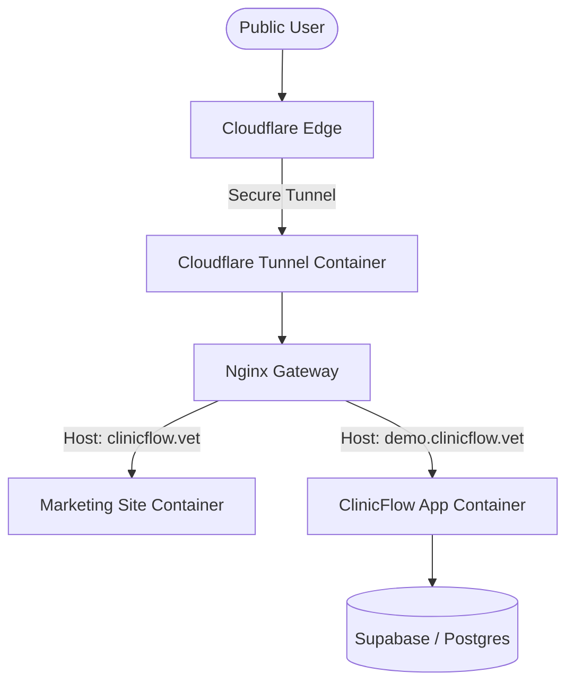

# ClinicFlow Infrastructure Architecture

This document outlines the high-level architecture of the ClinicFlow deployment stack.

## Architecture Diagram

## Component Details

### 1. Cloudflare Tunnel (`cloudflared`)
Acts as a secure bridge between your VPS and the internet. It initiates an outbound connection to Cloudflare, meaning no ports need to be opened on your firewall. Recommended tunnel name: `ClinicFlow-Production`.

### 2. Nginx Gateway
The central entry point for all incoming traffic. It performs **Host-based routing**:
- It inspects the `Host` header of the request.
- It routes traffic to the appropriate internal container based on the domain name.

### 3. Marketing Site
A static site built with Vite and served by Nginx. It contains the landing page, features, and marketing content.

### 4. ClinicFlow App
A Next.js application (standalone mode) that provides the core veterinary operating system.

## Security Features

- **Zero Port Exposure**: No ports are mapped to the public IP of the VPS.
- **Internal Networking**: All traffic between containers happens on a private Docker bridge network (`clinic-network`).
- **Environment Isolation**: Secrets are managed via `.env` files and passed to containers only as needed.

## Port Mapping (Local Dev)
For local development and testing, we expose:
- **Port 3000**: Direct access to the ClinicFlow App.
- **Port 8080**: Direct access to the Marketing Site.
In production, these can be disabled to further harden the system.
